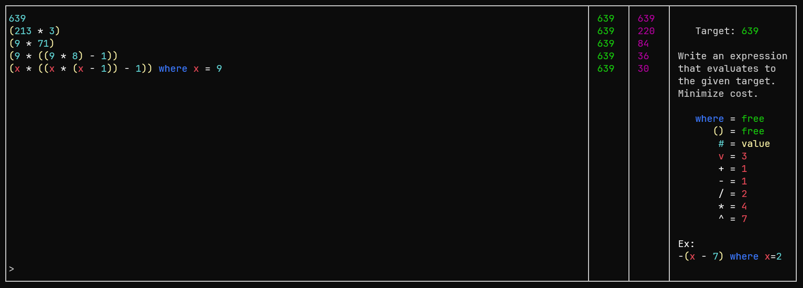

# parser-combinators-demo

This project is a simple game. The program must parse algebraic expressions, and learning to do this was the point of this project—I wrote my own monadic `Parser` (see [src/Parser.hs](src/Parser.hs)), and learned a significant amount about `Applicative`s and `Alternative`s in the process. I found [yet another way of explaining them](https://blog.jle.im/entry/functors-to-monads-a-story-of-shapes.html) which I found quite helpful, though I've come to think that truly understanding `Functor/Applicative/Monad` means understanding *everybody's* explanation, rather than finding some "best" one.

To run, clone the repository and run with `cabal run`. The game runs entirely in the terminal using ANSI codes. The goal of the game is to write an expression that evaluates to a given target value, while minimizing the "cost" of the expression (where numbers, operators, etc. each have an associated cost).



## Interesting Ideas
### Maxing (or rather, minning)
At the [Husky Competitive Programming Club](https://www.khoury.northeastern.edu/clubs_and_orgs/husky-competitive-programming-club/) we ran a challenge to see who could find the minimum-cost expression evaluating to `638095274`, using any means (computational, pen-and-paper). The minimum we could achieve was the following, with a cost of `76`:
```haskell
((x*x - 3)^2) + ((3*x - 2)^x)/(x*(x+3)-2) + 1 where x = 8
```
(if you find a better one, feel free to send it! You might have to mess with the code a bit though because it caps expressions at 1000 so they fit in the box.)

### Variable Shenanigans
Variables can reference each other, but the program hangs if the references are cyclic:
```haskell
x where x = y + 4, y = 2 * x
```

There is no variable capture. That is, substituting variables for values happens at the substitution location, not at the binding location. This can be abused to make `y` a "function" of `x` which gets "evaluated" by providing a substitution for `x`:
```haskell
-- evaluates to 42
(y where x = 5) + (y where x = 3) + (y where x = 1) where y = 2^x
```